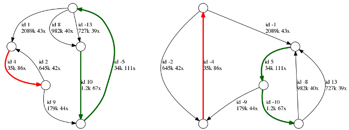

Flye manual
===========

Table of Contents
-----------------

- [Quick usage](#quickusage)
- [Examples](#examples)
- [Supported Input Data](#inputdata)
- [Parameter Descriptions](#parameters)
- [Flye output](#output)
- [Repeat graph](#graph)
- [Flye benchmarks](#performance)
- [Algorithm Description](#algorithm)


## <a name="quickusage"></a> Quick usage

```
usage: flye (--pacbio-raw | --pacbio-corr | --pacbio-hifi | --nano-raw |
	     --nano-corr | --nano-hq ) file1 [file_2 ...]
	     --out-dir PATH

	     [--genome-size SIZE] [--threads int] [--iterations int]
	     [--meta] [--polish-target] [--min-overlap SIZE]
	     [--keep-haplotypes] [--debug] [--version] [--help] 
	     [--scaffold] [--resume] [--resume-from] [--stop-after] 
	     [--read-error float] [--extra-params]

Assembly of long reads with repeat graphs

optional arguments:
  -h, --help            show this help message and exit
  --pacbio-raw path [path ...]
                        PacBio regular CLR reads (<20% error)
  --pacbio-corr path [path ...]
                        PacBio reads that were corrected with other methods (<3% error)
  --pacbio-hifi path [path ...]
                        PacBio HiFi reads (<1% error)
  --nano-raw path [path ...]
                        ONT regular reads, pre-Guppy5 (<20% error)
  --nano-corr path [path ...]
                        ONT reads that were corrected with other methods (<3% error)
  --nano-hq path [path ...]
                        ONT high-quality reads: Guppy5+ or Q20 (<5% error)
  --subassemblies path [path ...]
                        [deprecated] high-quality contigs input
  -g size, --genome-size size
                        estimated genome size (for example, 5m or 2.6g)
  -o path, --out-dir path
                        Output directory
  -t int, --threads int
                        number of parallel threads [1]
  -i int, --iterations int
                        number of polishing iterations [1]
  -m int, --min-overlap int
                        minimum overlap between reads [auto]
  --asm-coverage int    reduced coverage for initial disjointig assembly [not set]
  --hifi-error float    [deprecated] same as --read-error
  --read-error float    adjust parameters for given read error rate (as fraction e.g. 0.03)
  --extra-params extra_params
                        extra configuration parameters list (comma-separated)
  --plasmids            unused (retained for backward compatibility)
  --meta                metagenome / uneven coverage mode
  --keep-haplotypes     do not collapse alternative haplotypes
  --scaffold            enable scaffolding using graph [disabled by default]
  --trestle             [deprecated] enable Trestle [disabled by default]
  --polish-target path  run polisher on the target sequence
  --resume              resume from the last completed stage
  --resume-from stage_name
                        resume from a custom stage
  --stop-after stage_name
                        stop after the specified stage completed
  --debug               enable debug output
  -v, --version         show program's version number and exit
```

Input reads can be in FASTA or FASTQ format, uncompressed
or compressed with gz. Currently, PacBio (CLR, HiFi, corrected)
and ONT reads (regular, HQ, corrected) are supported. Expected error rates are
<20% for PB CLR/regular ONT, <5% for ONT HQ, <3% for corrected, and <1% for HiFi. Note that Flye
was primarily developed to run on uncorrected reads. You may specify multiple
files with reads (separated by spaces). Mixing different read
types is not yet supported. The `--meta` option enables the mode
for metagenome/uneven coverage assembly.

To reduce memory consumption for large genome assemblies,
you can use a subset of the longest reads for initial disjointig
assembly by specifying `--asm-coverage` and `--genome-size` options. Typically,
40x coverage is enough to produce good disjointigs.

You can run Flye polisher as a standalone tool using
`--polish-target` option.

## <a name="examples"></a> Examples

You can try Flye assembly on these ready-to-use datasets:

### E. coli P6-C4 PacBio data

The original dataset is available at the 
[PacBio website](https://github.com/PacificBiosciences/DevNet/wiki/E.-coli-Bacterial-Assembly).
We coverted the raw `bas.h5` file to the FASTA format for the convenience.

    wget https://zenodo.org/record/1172816/files/E.coli_PacBio_40x.fasta
    flye --pacbio-raw E.coli_PacBio_40x.fasta --out-dir out_pacbio --threads 4

with the `threads` argument being optional (you may adjust it for your environment), 
and `out_pacbio` being the directory where the assembly results will be placed.

### E. coli Oxford Nanopore Technologies data

The dataset was originally released by the 
[Loman lab](http://lab.loman.net/2015/09/24/first-sqk-map-006-experiment/).

    wget https://zenodo.org/record/1172816/files/Loman_E.coli_MAP006-1_2D_50x.fasta
    flye --nano-raw Loman_E.coli_MAP006-1_2D_50x.fasta --out-dir out_nano --threads 4


## <a name="inputdata"></a> Supported Input Data

### Oxford Nanopore

* The default mode for regular ONT data is `--nano-raw`. It works well for a good
range of datasets, from old R7 pores to the most recent R9.x and R10.x. The
expected error rate is 10-15%.

* For the most recent ONT data basecalled with Guppy5 use the new `--nano-hq` mode.
Expected error rate is <5%.

* For Q20 data, use a combination of `--nano-hq` and `--read-error 0.03`.

* If you have error-corrected ONT reads (with methods such as Canu), use `--nano-corr`.

### PacBio

* The default mode for regular PacBio CLR data is `--pacbio-raw`. Works for a wide range of
datasets (P5C3/P6C4/Sequel) with error rate 13-15%.

* Note that in CLR mode Flye assumes that the input files represent PacBio subreads, 
e.g. adaptors and scraps are removed and multiple passes of the same insertion sequence are separated. 
This is typically handled by PacBio instruments/toolchains, however we saw examples of problemmatic 
raw -> fastq conversions, which resulted into incorrect subreads. 
In this case, consider using [pbclip](https://github.com/fenderglass/pbclip) to fix your Fasta/q reads.

* For PacBio HiFi use the `--pacbio-hifi` mode. The default error-rate is 0.001
(in HPC space), and works well for the default CCS algorithm settings (e.g. 3+ polymerase passes).
Error could be adjusted via `--read-error`.

* If you have error-corrected PacBio reads (with methods such as Canu), use `--pacbio-corr`.

### Consensus of multiple contig sets

WARNING: this mode is being deprecated and will be removed in the future versions.
This is to make the future maintenance of Flye easier. Instead, we suggest to use
more specialized software, like [quickmerge](https://github.com/mahulchak/quickmerge).

```--subassemblies``` input mode generates a consensus of multiple high quality contig assemblies
(such as produced by different short/long read assemblers). The expected error rate
is <1%. You might want to skip the polishing stage with ```--iterations 0``` argument
(however, it might still be helpful to correct small structural errors).


### Input data preparation

Flye works directly with base-called raw reads and does not require any 
prior error correction or trimming. Flye automatically detects chimeric reads or reads with 
low quality ends.


## <a name="parameters"></a> Parameter descriptions

### Estimated genome size (optional since 2.8)

No longer required as input. However, it must be used in conjunction with
`--asm-coverage` option.

### Minimum overlap length

This sets a minimum overlap length for two reads to be considered overlapping.
In the latest Flye versions, this parameter is chosen automatically
based on the read length distribution (reads N90) and does not require manual setting.
Typical value is 3k-10k (and down to 1k for datasets with shorter read length).
Intuitively, we want to set this parameter as high as possible, so the
repeat graph is less tangled. However, higher values might lead to assembly gaps.

In some *rare* cases it makes sense to manually increase minimum overlap
for assemblies of big genomes with long reads and high coverage.

### Metagenome mode

Metagenome assembly mode. The main differences are that "regular" mode
assumes a relatively uniform coverage of the assembled genome and
makes certain desicions based on that. The metagenome mode is more general
in this respect, and works well for assembly of complex microbial
communities with highly non-uniform coverage and richer repeat content.
It is sensitive to very short sequences and underrepresented organisms at low read coverage 
(as low as 3x).

For relatively complex single genomes, "regular" mode often outperforms metageomic mode.

### Haplotype mode

By default, Flye (and metaFlye) collapses graph structures caused by
alternative haplotypes (bubbles, superbubbles, roundabouts) to produce
longer consensus contigs. The option `--keep-haplotypes` retains
the alternative paths on the graph, producing less contigouos, but
more detailed assembly.

### Scaffold

Starting from the version 2.9 Flye does not perform scaffolding by default,
which guarantees that all assembled sequences do not have any gaps.
Scaffolding could still be enabled by adding `--scaffold`.

### Trestle

WARNING: this mode is being deprecated and will be removed in the future versions.
This is to make the future maintenance of Flye easier. 

Trestle is an extra module that resolves simple repeats of
multipicity 2 that were not bridged by reads. Depending on the
datasets, it might resolve a few extra repeats, which is helpful
for small (bacterial genomes). Use `--trestle` option to enable the module.
On large genomes, the contiguity improvements are usually minimal,
but the computation might take a lot of time.

### Reducing RAM consumption

Typically, assemblies of large genomes at high coverage require
several hundreds of RAM. For high coverage datasets, you can reduce memory usage
by using only a subset of longest reads for initial disjointig extension
stage (usually the memory bottleneck). The parameter `--asm-coverage`
specifies the target coverage of the longest reads. Typically, 40x longest reads
is enough to produce good disjointigs. Regardless of this parameter,
all reads will be used at the later pipeline stages (e.g. for repeat resolution).

### Running only Flye polisher

To polish an existing assembly, you can run Flye polisher as a standalone tool 
using `--polish-target`. Paths to reads are specified similarly to the assembly mode,
and bam file could also be proveded instead of reads (the mapping stage in this case will
be skipped).


### Number of polishing iterations

Polishing is performed as the final assembly stage. By default, Flye runs one polishing 
iteration. Additional iterations might correct a small number of extra
errors (due to improvements on how reads may align to the corrected assembly). 
If the parameter is set to 0, the polishing is not performed.

### Re-starting from a particular assembly stage

Use `--resume` to resume a previous run of the assembler that may have terminated
prematurely (using the same output directory). 
The assembly will continue from the last previously completed step.

You might also resume from a particular stage with `--resume-from stage_name`,
where `stage_name` is a choice of `assembly, consensus, repeat, trestle, polishing`.
For example, you might supply different sets of reads for different stages.

## <a name="output"></a> Flye output

The main output files are:

* `assembly.fasta` - Final assembly. Contains contigs and possibly scaffolds (see below).
* `assembly_graph.{gfa|gv}` - Final repeat graph. Note that the edge sequences might be
different (shorter) than contig sequences, because contigs might include multiple
graph edges (see below).
* `assembly_info.txt` - Extra information about contigs (such as length or coverage).

Each contig is formed by a single unique graph edge. If possible, unique contigs are
extended with the sequence from flanking unresolved repeats on the graph. Thus,
a contig fully contains the corresponding graph edge (with the same id), but might
be longer then this edge. This is somewhat similar to unitig-contig relation
in OLC assemblers. In a rare case when a repetitive graph edge is not covered by 
the set of "extended" contigs, it will be also output in the assembly file.

Sometimes it is possible to further order contigs into scaffolds based on the 
repeat graph structure. These ordered contigs will be output as a part of scaffold
in the assembly file (with a `scaffold_` prefix).  Since it is hard to give a reliable estimate of the
gap size, those gaps are represented with the default 100 Ns. `assembly_info.txt`
file (below) contains additional information about how scaffolds were formed.

Extra information about contigs/scaffolds is output into the `assembly_info.txt` file.
It is a tab-delimited table with the columns as follows:

* Contig/scaffold id
* Length
* Coverage
* Is circular, (Y)es or (N)o
* Is repetitive, (Y)es or (N)o
* Multiplicity (based on coverage)
* Alternative group
* Graph path (graph path corresponding to this contig/scaffold).

Scaffold gaps are marked with `??` symbols, and `*` symbol denotes a
terminal graph node.

Alternative contigs (representing alternative haplotypes) will have the same
alt. group ID. Primary contigs are marked by `*`

## <a name="graph"></a> Repeat graph

The Flye algorithms are using repeat graph as a core data structure. 
In difference to de Bruijn graphs which require exact k-mer matches,
repeat graphs are built using approximate sequence matches, thus
can tollerate higher noise of SMS reads.

The edges of repeat graph represent genomic sequence, and nodes define
the junctions. All edges are classified into unique and repetitive.
The genome traverses the graph in an unknown way, so as each unique
edge appears exactly once in this traversal. Repeat graphs are useful
for repeat analysis and resolution - which are one of the key 
genome assembly challenges.

<p align="center">
  
</p>

Above is an example of a repeat graph of a bacterial assembly.
Each edge is labeled with its id, length and coverage. Repetitive edges are shown
in color, and unique edges are black. Note that each edge is represented in 
two copies: forward and reverse complement (marked with +/- signs), 
therefore the entire genome is represented in two copies as well. 

In this example, there are two unresolved repeats: (i) a red repeat of 
multiplicity two and length 35k and (ii) a green repeat cluster of multiplicity
three and length 34k - 36k. As the repeats remained unresolved, there are no reads
in the dataset that cover those repeats in full. Five unique edges 
will correspond to five contigs in the final assembly.

Repeat graphs produced by Flye could be visualized using
[AGB](https://github.com/almiheenko/AGB) or [Bandage](https://github.com/rrwick/Bandage).

Repeat graph before repeat resolution could be found in
the `20-repeat/graph_before_rr.gv` file.


## <a name="performance"></a> Flye benchmarks


| Genome                   | Data           | Asm.Size  | NG50     | CPU time  | RAM    |
|--------------------------|----------------|-----------|----------|-----------|--------|
| [E.coli][ecoli]          | PB 50x         | 4.6 Mb    | 4.6 Mb   | 2 h       | 2 Gb   |
| [C.elegans][ce]          | PB 40x         | 107 Mb    | 2.7 Mb   | 100 h     | 31 Gb  |
| [A.thaliana][at]         | PB 75x         | 120 Mb    | 8.7 Mb   | 100 h     | 59 Gb  |
| [D.melanogaster][dm-ont] | ONT 30x        | 136 Mb    | 13.8 Mb  | 130 h     | 33 Gb  |
| [D.melanogaster][dm-pb]  | PB 120x        | 141 Mb    | 11.5 Mb  | 150 h     | 70 Gb  |
| [Human NA12878][na12878] | ONT 35x (rel6) | 2.8 Gb    | 30.3 Mb  | 3100 h    | 394 Gb |
| [Human CHM13 ONT][t2t]   | ONT 120x (rel5)| 2.9 Gb    | 69.5 Mb  | 4000 h    | 450 Gb |
| [Human CHM13 HiFi][t2t]  | PB HiFi 30x    | 3.0 Gb    | 34.8 Mb  | 780 h     | 141 Gb |
| [Human HG002][hg002]     | PB ONT  110x   | 2.9 Gb    | 46.9 Mb  | 4000 h    | 409 Gb |
| [Human CHM1][chm1]       | PB 100x        | 2.8 Gb    | 18.6 Mb  | 2700 h    | 444 Gb |
| [Cliveome Q20][cliveome] | ONT 35x        | 3.0 Gb    | 46.5 Mb  | 2000 h    | 257 Gb |
| [HMP mock][hmp]          | PB meta 7 Gb   | 68 Mb     | N/A      | 60 h      | 72 Gb  |
| [Zymo Even][zymo]        | ONT meta 14 Gb | 65 Mb     | N/A      | 60 h      | 129 Gb |
| [Zymo Log][zymo]         | ONT meta 16 Gb | 29 Mb     | N/A      | 100 h     | 76 Gb  |
| [Sheep gut][sheep]       | HiFi meta 255G | 4.2 Gb    | N/A      | 3500 h    | 662 Gb |

[na12878]: https://github.com/nanopore-wgs-consortium/NA12878/blob/master/Genome.md
[ce]: https://github.com/PacificBiosciences/DevNet/wiki/C.-elegans-data-set
[at]: https://downloads.pacbcloud.com/public/SequelData/ArabidopsisDemoData/
[dm-pb]: https://github.com/PacificBiosciences/DevNet/wiki/Drosophila-sequence-and-assembly
[dm-ont]: https://www.ebi.ac.uk/ena/data/view/SRR6702603
[hg002]: https://github.com/human-pangenomics/HG002_Data_Freeze_v1.0
[ecoli]: https://github.com/PacificBiosciences/DevNet/wiki/E.-coli-Bacterial-Assembly
[hmp]: https://github.com/PacificBiosciences/DevNet/wiki/Human_Microbiome_Project_MockB_Shotgun 
[chm1]: https://trace.ncbi.nlm.nih.gov/Traces/sra/?study=SRP044331
[t2t]: https://github.com/nanopore-wgs-consortium/CHM13
[zymo]: https://github.com/LomanLab/mockcommunity
[cliveome]: https://labs.epi2me.io/cliveome_2010.05/
[sheep]: https://www.ncbi.nlm.nih.gov/bioproject/?term=PRJNA595610

The assemblies generated using Flye 2.9 could be downloaded from [Zenodo](https://doi.org/10.5281/zenodo.5228989).
All datasets were run with default parameters for the corresponding read type
with the following exceptions: CHM13 T2T, CHM1 and HG002 were run with `--asm-coverage 50`.

Note that this version of the table reflects contigs NG50, while the previous versions
were refering to scaffold NG50.

## <a name="algorithm"></a> Algorithm Description

This is a brief description of the Flye algorithm. Please refer to the manuscript
for more detailed information. The draft contig extension is organized as follows:

* K-mer counting / erroneous k-mer pre-filtering
* Solid k-mer selection (k-mers with sufficient frequency, which are unlikely to be erroneous)
* Contig extension. The algorithm starts from a single read and extends it
  with a next overlapping read (overlaps are dynamically detected using the selected
  solid k-mers).

Note that we do not attempt to resolve repeats at this stage, thus
the reconstructed contigs might contain misassemblies. 
Flye then aligns the reads on these draft contigs using minimap2 and
calls a consensus. Afterwards, Flye performs repeat analysis as follows:

* Repeat graph is constructed from the (possibly misassembled) contigs
* In this graph all repeats longer than minimum overlap are collapsed
* The algorithm resolves repeats using the read information and graph structure
* The unbranching paths in the graph are output as contigs

If enabled, after resolving bridged repeats, Trestle module attempts to resolve simple unbridged
repeats (of multiplicity 2) using the heterogeneities between repeat copies.
Finally, Flye performs polishing of the resulting assembly
to correct the remaining errors:

* Alignment of all reads to the current assembly using minimap2
* Partition the alignment into mini-alignments (bubbles)
* Error correction of each bubble using a maximum likelihood approach

The polishing steps could be repeated, which might slightly increase quality for some datasets.
