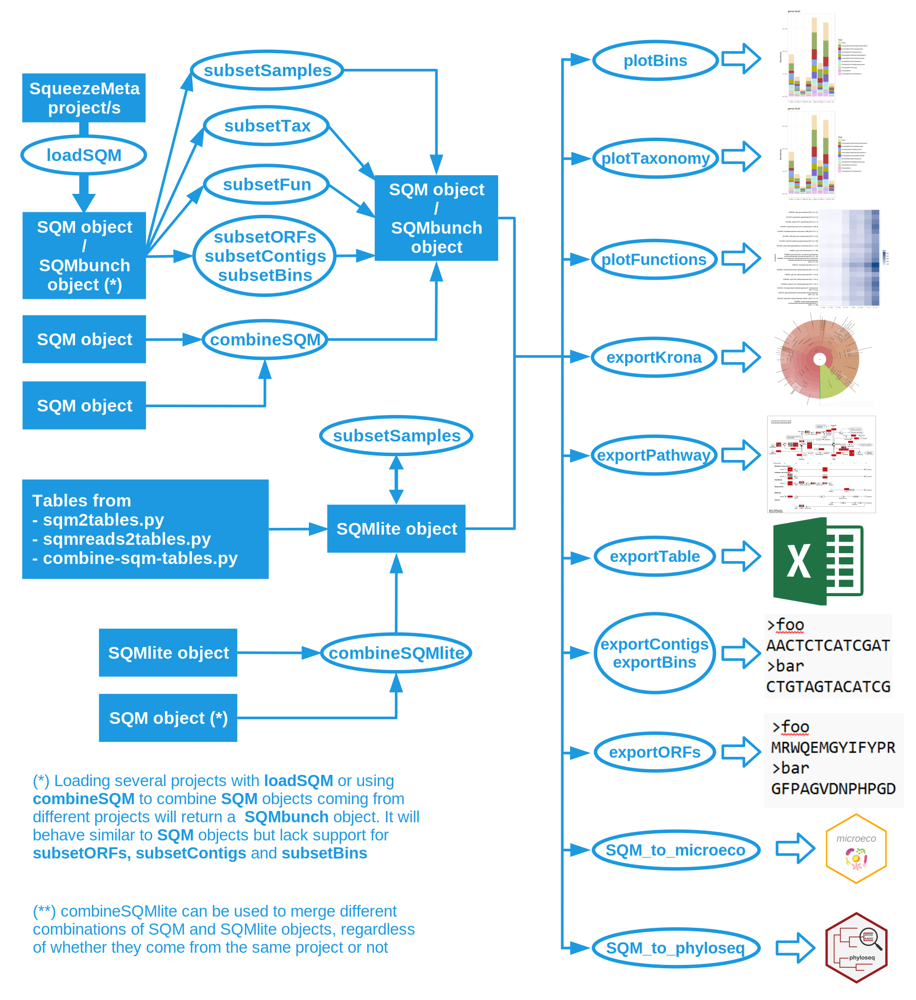

**********************
The SQMtools R package
**********************

**This package provides an easy way to expose the different results of SqueezeMeta (orfs, contigs, bins, taxonomy, functions…) into R, as well as a set of utility functions to filter and display SqueezeMeta results.**

.. note::
  The documentation below aims to describe the philosophy, usage, and internals of the SQMtools package, initially described `here <https://bmcbioinformatics.biomedcentral.com/articles/10.1186/s12859-020-03703-2>`_. For detailed (albeit maybe a bit outdated) usage examples see also the `wiki entry <https://github.com/jtamames/SqueezeMeta/wiki/Using-R-to-analyze-your-SQM-results>`_.

Design philosophy
=================

**SQMtools aims to simplify the analysis of complex metagenomic datasets** by representing them as a single object inside the R environment for statistical analysis. Once a project has been loaded into R with SQMtools the user can:

- Make basic plots representing its taxonomical and functional composition
- Subset it to select only certain taxa, functions or bins/MAGs
- Access the individual components of the object (e.g. taxonomy tables, contig sequences, bin qualities, etc) in order to perform custom analyses or feed the data to other R packages. In particular, we provide :ref:`bindings <bindings>` for `microeco <https://chiliubio.github.io/microeco/>`_ and `phyloseq <https://joey711.github.io/phyloseq/>`_, but all the data can also be accessed directly. 

**The main idea behind SQMtools is to speed up the exploration of metagenomic results by facilitating data inspection and filtering.** A standard workflow in *SQMtools* usually involves:

1) :ref:`Loading your project <SQMtools load>`
2) :ref:`Inpecting taxonomic/functional patterns <SQMtools plots>` in the whole project (e.g. plotting taxonomic distribution across samples)
3) Locating certain taxa/functions of interest (based on the results of the preliminary inspection, or on prior knowledge about the study system) and :ref:`generating a subset <SQMtools subset>` containing only those taxa/functions
4) Inspecting taxonomic/functional patterns in the subset. For example, making a subset containing some functions of interest and then making a taxonomic plot of that subset will inform us of the relative abundance and taxonomic distribution of those functions of interest in our samples

  Basic workflow of the SQMtools package. The basic unit used in the package is the SQM object. This object can contain a full SqueezeMeta project or a subset of genes, contigs or bins. The data in the SQM object can be accessed directly (e.g. for using it with other R packages such as vegan for ordination analyses or DESeq2 for differential abundance analysis) but we also provide some utility functions for exploring the most abundant functions or taxa in a SQM object. Alternatively, aggregate tables can be loaded into a SQMlite objects, which supports plot and export functionality. SQMlite objects can not be subsetted, but can be combined.

.. _SQMtools load:
Loading data into SQMtools
==========================

The :doc:`SQMtools/loadSQM` function can be used the output of one or more :doc:`SqueezeMeta.pl <execution>` runs into a single object. It also works directly with compressed zip projects generated with :ref:`sqm2zip.py <sqm2zip>`. 

.. code-block:: r

  library(SQMtools)
  project = loadSQM("/path/to/project/")

The code above will generate a single :ref:`SQM object <SQM object>` containing all the information relative to the project. More than one project can be loaded at the same time (e.g. ``loadSQM( c("/path/to/project1", "/path/to/project2") )``. In this case, the call to *loadSQM* would return a single :ref:`SQMbunch object <SQMbunch object>` with the combined information from all the input projects, which would otherwise behave similarly.

Alternatively, the :doc:`SQMtools/loadSQMlite` function can be used to load aggregated taxonomic and functional tables generated with :ref:`sqm2tables.py <sqm2tables>` or :ref:`sqmreads2tables.py`. The resulting :ref:`SQMlite object <SQMlite object>` is much more lightweight, but carries not information on individual ORFs, contigs or bins and does not support subsetting.

.. _SQM object:
The SQM object structure
------------------------

A *SQM object* contains all the relevant information from a SqueezeMeta project, organized in nested an R lists (figure below). For example, a matrix with the taxonomic composition of the different samples at the phylum level in percentages can be obtained with ``project$taxa$phylum$percent`` while a matrix with the average copy number per genome of the different PFAMs across samples can be obtained with ``project$functions$PFAM$copy_number``.

.. figure:: ../resources/Figure_2_SQMtools.svg
  :alt: Structure of the SQM R object

  Structure of the SQM R object. If external databases for functional classification were provided to SqueezeMeta via the *-extdb* argument, the corresponding abundance (reads and bases), tpm and copy number profiles will be present in *SQM$functions* (e.g. results for the CAZy database would be present in *SQM$functions$CAZy*. Additionally, the extended names of the features present in the external database will be present in *SQM$misc* (e.g. *SQM$misc$CAZy_names*). The SQMlite object will have a similar structure, but will lack the *SQM$orfs*, *SQM$contigs* and *SQM$bins* section. Additionally, if the results come from a *sqm_reads.pl* or *sqm_longreads.pl* run, the SQMlite object will also be missing TPM, bases and copy numbers for the different functional classification methods.

.. _SQMbunch object:
The SQMbunch object structure
-----------------------------
A *SQMbunch* object contains all the relevant information for several SqueezeMeta projects. It has a similar structure to a :ref:`SQM object <SQM object>`, but it lacks the ``orfs``, ``contigs`` and ``bins`` sections. Instead, it has a separate list named ``projects``, which contains individual *SQM* objects for each of the projects that were loaded.

.. _SQMlite object:
The SQMlite object structure
----------------------------
A *SQMlite* object contains aggregated taxonomic and functional tables. It has a similar structure to a :ref:`SQM object <SQM object>`, but it lacks the ``orfs``, ``contigs`` and ``bins`` sections.

.. _SQMtools subset:
Creating subsets of your data
=============================
:ref:`SQM <SQM object>` and :ref:`SQMbunch <SQMbunch object>` objects can be subsetted to select only certain features of interest. This can be achieved with the following functions:

- Functions working for *SQM* and *SQMbunch* objects:
    - :doc:`SQMtools/subsetTax`: select data from the requested taxon
    - :doc:`SQMtools/subsetFun`: select data from the requested function/s

- Functions working for *SQM* objects only:
    - :doc:`SQMtools/subsetSamples`: select the requested samples
    - :doc:`SQMtools/subsetBins`: select data from the requested bins
    - :doc:`SQMtools/subsetContigs`: select arbitrary contigs
    - :doc:`SQMtools/subsetORFs`: select arbitrary ORFs

For example, the code

.. code-block:: r

  project.poly = subsetTax(project, "genus", "Polynucleobacter")

would return a new *SQM* or *SQMbunch* object containing only the information from contigs that belonged to the *Polynucleobacter* genus, the ORFs contained in them, and the bins/MAGs that contain those contigs.

Subsetting involves the following steps:

- Determining which ORFs, contigs and bins are to be included in the subsetted object
- Recalculating aggregated taxonomic and functional tables based on the selected ORFs/contigs
- If requested, renormalize certain functional abundance metrics to make them relative to the data included in the subset (see below)
- Recalculate bin abundance metrics based on the selected contigs. If requested, also recalculate bin completeness/contamination

.. note::
  *SQMlite* objects can not be subsetted. This means that results coming from :ref:`sqm_reads.pl <sqm_reads>` and :ref:`sqm_longreads.pl <sqm_longreads>` can also not be subsetted within SQMtools. However, a similar effect can by first filtering the results with the the ``--query`` parameter of the :ref:`sqmreads2tables.py <sqmreads2tables>` script, and then loading the resulting tables into SQMtools with :doc:`SQMtools/loadSQMlite`.

Data renormalization on subsetting
----------------------------------

When generating a subset, the TPM and copy number of functions can be rescaled so it becomes relative to the reads included in the subset, instead of to the reads included in the original object.

For example, upon loading a project into *SQMtools*, the copy number of each function represents the average number of copies of that function per genome in the whole community. If we then run `subsetTax` to select the contigs belonging to a taxa of interest, the copy numbers in the subsetted object will have a different interpretation depending on whether we rescale or not.

- **If no rescaling is performed**, the copy numbers in the subset will represent the average number of copies of each function in the full metagenome **that were coming from the taxa of interest**

- **If rescaling is performed**, the copy numbers in the subset will represent the average number of copies of each function **in the taxa of interest**

For further clarification, compare the following two assertions:

- *"For each genome in my samples (regardless of its taxonomy) cyanobacteria contributed on average 0.2 toxin production genes"*

- *"In my samples, each cyanobacterial genome had on average 2 toxin production genes"*

In addition to this, when generating a subset the completeness and contamination of bins can be recalculated according to only the contigs present in the subset.

The different subset functions have different default behaviour. As a rule of thumb, functions that expect to retrieve whole genomes after subsetting (`subsetTax`, `subsetBins`) will perform renormalization, while functions that retreive arbitrary parts of a genome (`subsetTax`, `subsetContigs`, `subsetORFs`) will recalculate bin statistics.

The default behaviour of each subset function is listed in the table below, but it can be controlled manually through the `rescale_tpm`, `rescale_copy_number` and `recalculate_bin_stats` arguments. 

=============    ===========    ===================    =====================
Method           rescale_tpm    rescale_copy_number    recalculate_bin_stats
=============    ===========    ===================    =====================
subsetSamples    N/A            N/A                    N/A
subsetTax        TRUE           TRUE                   TRUE
subsetFun        FALSE          FALSE                  FALSE
subsetBins       TRUE           TRUE                   N/A
subsetContigs    FALSE          FALSE                  TRUE
subsetORFs       FALSE          FALSE                  TRUE
=============    ===========    ===================    =====================

.. note::
   Completeness and contamination statistics are initially calculated using CheckM2, but upon subsetting they are recalculated using a re-implementation of the CheckM1 algorithm over root marker genes. This can give an idea on how adding/removing certain contigs affects the completeness of a bin, but should be considered as less reliable than manually running CheckM2 again.

Combining SQM and SQMlite objects
=================================
*SQMtools* also offers ways to combine several :ref:`SQM <SQM object>` and :ref:`SQMlite <SQMlite object>` objects into a single object: 

- :doc:`SQMtools/combineSQM`: this function combines several *SQM* objects into a single object containing all their information

  - If all the input objects come from the same projects (e.g. because they are different subsets of the same original dataset) this function will also return a *SQM* object
  - If the input objects come from different projects (i.e. they were generated from different *SqueezeMeta.pl* runs on different samples) then this function will return a *SQMbunch* object

- :doc:`SQMtools/combineSQMlite`: this functions combines several *SQM* and/or *SQMlite* objects into a single :ref:`SQMlite object <SQMlite object>`

.. _SQMtools plots:
Creating plots and exporting data
=================================
*SQMtools* offers the utility functions for creating plots and exporting data. The following work with *SQM*, *SQMbunch* and *SQMlite* objects:

- :doc:`SQMtools/plotTaxonomy`
- :doc:`SQMtools/plotFunctions`
- :doc:`SQMtools/plotBins`
- :doc:`SQMtools/exportKrona`
- :doc:`SQMtools/exportPathway`

The following functions work for *SQM* and *SQMbunch* objects only:

- :doc:`SQMtools/exportORFs`
- :doc:`SQMtools/exportContigs`
- :doc:`SQMtools/exportBins`

The following functions work with arbitrary tables/matrices:

- :doc:`SQMtools/plotBars`
- :doc:`SQMtools/plotHeatmap`
- :doc:`SQMtools/exportTable`

.. _bindings::
Interacting with other R packages
=================================
As described in :ref:`SQM object`, all the relevant information is exposed as R data.frames, data.tables, matrices or vectors, and can be used directly as inputs for other R packages or custom analysis scripts. For convenience, we also provide the following functions to load the data contained in an *SQM*, *SQMbunch* or *SQMlite* object into other microbiome analysis libraries:

- :doc:`SQMtools/SQM_to_microeco`
- :doc:`SQMtools/SQM_to_phyloseq`

Working with bins
=================
*SQMtools* offers some functions for basic bin/MAG curation

- :doc:`SQMtools/find_redundant_contigs`: find redundant contigs within a bin
- :doc:`SQMtools/remove_contigs_from_bin`: remove the selected contigs from a bin
- :doc:`SQMtools/create_bin`: create a new bin from the selected contigs

``remove_contigs_from_bin`` and ``create_bin`` will return a new *SQM* object containing the new binning information, including recalculation of bin contamination/completeness using CheckM1 markers.

.. note::
  While this provides a fast way of removing obviously redundant contigs or creating custom bins within the *SQMtools* package, if you want to perform a more careful bin/MAG curation you should probably consider other tools such as anvi’o. You can always use the ``create_bin`` function to re-create the anvi’o curated bin into *SQMtools*.

Data normalization strategies
=============================
*SQMtools* normalizes the abundances of taxa, functions and bins in different ways:

- Taxonomy
    - Raw abundances: raw number of reads mapping to each taxon
    - Raw bases: raw number of bases mapping to each taxon
    - Percentages: percent number of reads mapping to each taxon

- Functions, ORFs, contigs (referred to as "features" in the lines below)
    - Raw abundances: raw number of reads mapping to each feature
    - Raw bases: raw number of bases mapping to each feature
    - Coverage: average number of reads mapped per base of each feature
    - Coverage per million reads: coverage value if only 1M reads were present in each sample
    - Transcripts per million: number of times we would retreive each feature if sampled 1M features from the population
    - Copy number: average number of times that each feature is present per genome in our population

- Bins
    - Raw abundances: raw number of reads mapping to each bin
    - Raw bases: raw number of bases mapping to each bin
    - Coverage: average number of reads mapped per base of each bin
    - Coverage per million reads: coverage value if only 1M reads were present in each sample

More details on this can be found on the `SQMtools paper <https://bmcbioinformatics.biomedcentral.com/articles/10.1186/s12859-020-03703-2>`_. Our intentions here are to include several common normalization methods so our users can easily pick the ones that suit them the best. At the same time, we understand that novice users can find all these options overwhelming, and would rather prefer to just have the "best" way given to them. While we don't want to push so hard towards any particular method (since this is anyways a field that is constantly evolving) **we have set the defaults of many functions in *SQMtools* to reflect what we currently believe to the the best (or at least safest) approach**. Below we discuss our current view on the matter (which is subject to change as we too keep learning better ways of doing things):

- **Taxonomy: we recommend using percentages for visualization and basic comparisons.** While you could in theory do alpha and beta-diversity analyses with this data, there are practical reasons why you should be careful when doing that, since **taxonomy from shotgun metagenomic datasets is less reliable than when obtained from marker genes such as 16S rRNA** (see :ref:`SQM tax caveats`). In any case, if you go that route please rarefy your data prior to alpha diversity analysis (and probably beta diversity too, although the jury is still out in that one). A detailed discussion of best practices in alpha and beta diversity analysis is otherwise beyond the scope of this documentation.

- **Functions: we recommend using copy numbers for mostly everything, when available**. These are calculated by dividing the coverage of each feature by the median coverage of a set of universal single copy genes that are assumed to be present only once in all prokaryotic genomes. Thus, **the copy number of a feature represents its average number of copies in the genomes of a population**. This method controls by both feature lenght and sequencing depth, and since copy numbers are ratios they should be to an extent robust against the `compositionality problem <https://www.frontiersin.org/journals/microbiology/articles/10.3389/fmicb.2017.02224/full>`_. By default, *SQMtools* will use a set of ten marker genes taken from `Salazar et al., (2019) <https://pubmed.ncbi.nlm.nih.gov/31730850/>`_. These markers in particular are assumed to be both *universal* and *housekeeping* genes, meaning that they **can be used to normalize both metagenomics and metatranscriptomics data** (though the interpretation of copy numbers for metatranscriptomic data varies, it being the average number of transcripts of a feature that are produced for each transcript of the housekeeping genes). Different single copy genes for normalization can be selected when loading the project into *SQMtools* with :doc:`SQMtools/loadSQM`.

- **Bins: we currently favor *cpm* for comparing bin abundances within and between samples**, since it controls for genome length and sequencing depth. However, as *cpm* are proportions, they can be subjected to `compositionality biases <https://www.frontiersin.org/journals/microbiology/articles/10.3389/fmicb.2017.02224/full>`_, particularly when the sample space is dominated by only a few high abundance bins.

.. note::
  If planning to using the data loaded into SQMtools with another R package, check whether that second package uses raw reads as its input, since many packages (e.g. differential abundance packages) do their own normalization internally.

List of functions and detailed documentation
============================================

.. toctree::
   :glob:

   SQMtools/*
