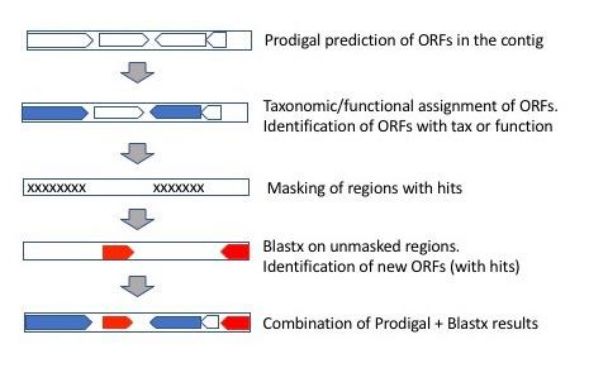

*************************************
Explanation of SqueezeMeta algorithms
*************************************

.. _lca:
The LCA algorithm
=================
We use a Last Common Ancestor (LCA) algorithm to assign taxa to genes.
For the amino acid sequence of each gene, DIAMOND (blastp) homology searches are
done against the NCBI nr database. A e-value cutoff of ``1e-03`` is set by default. The
best hit is obtained, and then we select a range of hits (valid hits) having at least 80% of
the bitscore of the best hit and differing in less than 10% identity also with the best hit
(these values can be configured). The LCA of all these hits is obtained, that is, the taxon
common to all hits. This LCA can be found at diverse taxonomic ranks (from phylum to
species). We allow some flexibility in the definition of LCA: a small number of hits
belonging to other taxa than the LCA can be allowed. In this way we deal with putative
transfer events, or incorrect annotations in the database. This value is by default 10% of
the total number of valid hits, but can be set by the user. Also, the minimum number of
hits to the LCA taxa can be set.

An example is shown in the next table:

+---------+--------+---------------------------+----------+---------+
| Gene_ID | Hit_ID |        Hit_Taxonomy       | Identity | e_value |
+=========+========+===========================+==========+=========+
|         |        | Genus:  Polaribacter      |          |         |
|  Gene1  |  Hit1  | Family: Flavobacteriaceae |   75.2   |  1e-94  |
|         |        | Order:  Flavobacteriales  |          |         |
+---------+--------+---------------------------+----------+---------+
|         |        | Genus:  Polaribacter      |          |         |
|  Gene1  |  Hit2  | Family: Flavobacteriaceae |   71.3   |  6e-88  |
|         |        | Order:  Flavobacteriales  |          |         |
+---------+--------+---------------------------+----------+---------+
|  Gene1  |  Hit3  | Family: Flavobacteriaceae |   70.4   |  2e-87  |
|         |        | Order:  Flavobacteriales  |          |         |
+---------+--------+---------------------------+----------+---------+
|         |        | Genus:  Algibacter        |          |         |
|  Gene1  |  Hit4  | Family: Flavobacteriaceae |   68.0   |  2e-83  |
|         |        | Order:  Flavobacteriales  |          |         |
+---------+--------+---------------------------+----------+---------+
|         |        | Genus:  Rhodospirillum    |          |         |
|  Gene1  |  Hit5  | Family: Rhodospirillaceae |   60.2   |  6e-68  |
|         |        | Order:  Rhodospirillales  |          |         |
+---------+--------+---------------------------+----------+---------+

In this case, the four first hits are the valid ones. Hit 5 does not make the identity and
e-value thresholds. The LCA for the four valid hits is Family: *Flavobacteriaceae*, that
would be the reported result.

Our LCA algorithm includes strict cut-off identity values for different taxonomic ranks,
according to `Luo et al. (2014) <https://pmc.ncbi.nlm.nih.gov/articles/PMC4005636/>`_ *Nucleic Acids Research* **42**:e73. This means that hits must pass a minimum (aminoacid) identity level in order to be used for assigning particular
taxonomic ranks. These thresholds are:

============  ======
Rank          Cutoff
============  ======
Superkingdom  40%
Phylum        42%
https://fpusan-doc-tests.readthedocs.io/en/latest/alg_details.htmlClass         46%
Order         50%
Family        55%
Genus         60%
Species       85%
============  ======

Hits below these levels cannot be used to make assignments for the corresponding rank. For instance, a
protein will not be assigned to species level if it has no hits above 85% identity. Also, a
protein will remain unclassified if it has no hits above 40% identity. The inclusion of
these thresholds guarantees that no assignments are done based on weak, inconclusive
hits. Overall, this results in highly conservative, but also very trustworthy taxonomic annotations.

.. _euk annot:
Taxonomic annotation of eukaryotic ORFs
---------------------------------------

By default, SqueezeMeta applies `Luo et al. (2014) <https://pmc.ncbi.nlm.nih.gov/articles/PMC4005636/>`_ identity cutoffs in order to assign an ORF to a given taxonomic rank (see :ref:`lca`). In our tests, these cutoffs resulted in a very low percentage of annotation for eukaryotic ORFs. We believe that the main reasons are the following:

- Those filters were calculated using prokaryotic genomes, and might not be valid in eukaryotes.
- Eukaryotes are poorly represented in the databases, leading to lower similarities on average.

The treatment of eukaryotic ORFs will differ depending on how :doc:`SqueezeMeta.pl <execution>`, :ref:`sqm_reads.pl <sqm_reads>` or :ref:`sqm_longreads.pl <sqm_longreads>` are launched, and the result files that are used afterwards.

- The raw results produced by :doc:`SqueezeMeta.pl <execution>`,  :ref:`sqm_reads.pl <sqm_reads>` and :ref:`sqm_longreads.pl <sqm_longreads>` will apply identity cutoffs to all taxa by default unless the flag ``--euk`` is passed when running the script, in which case the identity cutoffs will only be applied to eukaryotic reads.

    - An exception to this is the final step of the *SqueezeMeta* pipeline, which runs :ref:`sqm2tables.py <sqm2tables>` with default parameters, see :ref:`sqm2tables in pipeline`. In that step, both types of results will be produced regardless of whether the ``--euk`` flag is passed or not, see below.

- When creating taxonomic aggregate tables with :ref:`sqm2tables.py <sqm2tables>` (for projects created with *SqueezeMeta.pl*) and :ref:`sqmreads2tables.py <sqmreads2tables>` (for projects created with :ref:`sqm_reads.pl <sqm_reads>` and :ref:`sqm_longreads.pl <sqm_longreads>`) three sets of results will be generated **regardless of whether the --euk flag was passed when running the script**.
  
    - *allfilter* files, containing ORF, contig and aggregate taxonomies obtained after applying identity filters to ALL taxa.
    - *prokfilter* files, containing ORF, contig and aggregate taxonomies obtained after applying identity filters to prokaryotic taxa only. This would replicate the behaviour of ``--euk`` flag.
    - *nofilter* files, containing ORF, contig and aggregate taxonomies obtained after applying NO identity filters at all.
  
  The advantage of this method is that there is no need to repeat the whole run to change the behaviour of identity cutoffs.

- When using :doc:`SQMtools` to analyze your data, you get to choose the behaviour of identity cutoffs (*allfilter*, *prokfilter*, *nofilter*) through the ``tax_mode`` parameter in the ``loadSQM`` and ``loadSQMlite`` functions (with the default being ``"prokfilter"``, i.e. using identity cutoffs for prokaryotes but not eukaryotes).

Handling of unclassified and missing ranks in NCBI taxonomy
-----------------------------------------------------------
.. note::
   The discussion below applies only to the results generated by :ref:`sqm2tables.py <sqm2tables>` (which it itself ran as the final step of the SqueezeMeta pipeline, see :ref:`sqm2tables in pipeline`) and :ref:`sqmreads2tables.py <sqmreads2tables>`, and also when loading projects in R with :doc:`SQMtools`. Other SqueezeMeta scripts will not correct for this and report taxonomies directly as received from NCBI. 

SqueezeMeta uses NCBI's nr database for taxonomic annotation, and reports the superkingdom, phylum, class, order, family, genus and species ranks. In some cases, the NCBI taxonomy is missing some intermediate ranks. For example, the NCBI taxonomy for the order *Trichomonadida* is:

- superkingdom: *Eukaryota*
- no rank: *Parabasalia*
- order: *Trichomonadida*

NCBI does not assign Trichomonadida to any taxa in the class and phylum ranks. For clarity, :ref:`sqm2tables.py <sqm2tables>` and :ref:`sqmreads2tables.py <sqmreads2tables>` will indicate this by recycling the highest available taxonomy and adding the ``"(no <rank> in NCBI)"`` string after it. The scripts will also recycle the highest available taxonomy and use it to populate lower level taxonomic ranks, by adding the ``"Unclassified"`` string before it.

For example, ORFs that can be classified down to the *Trichomonadida* order (which itself lacks class and phylum classifications in NCBI) and that could not be classified at the family level or below will be reported as:

- superkingdom: *Eukaryota*
- phylum: *Trichomonadida (no phylum in NCBI)*
- class: *Trichomonadida (no class in NCBI)*
- order: *Trichomonadida*
- family: *Unclassified Trichomonadida*
- genus: *Unclassified Trichomonadida*
- species: *Unclassified Trichomonadida*

.. _nocds:
Meaning of "Unmapped", "Unclassified" and "No CDS" in taxonomy results
----------------------------------------------------------------------
.. note::                                                                                                                               The discussion below applies only to the results generated by :ref:`sqm2tables.py <sqm2tables>` (which it itself ran as the final step of the SqueezeMeta pipeline, see :ref:`sqm2tables in pipeline`) and :ref:`sqmreads2tables.py <sqmreads2tables>`, and also when loading projects in R with :doc:`SQMtools`.

The "Unclassified" category represents only the features that were classifiable with our method (i.e. contained a protein-coding sequence) but were not actually classified (because they did not have good enough hits to the reference database).

In addition to the normal taxon names and the “Unclassified” category, the results will contain 2 extra categories:

- ``"Unmapped"``: reads not mapping to any contigs.
- ``"No CDS"``: features (or reads mapping to features) that contained no protein-coding sequences (e.g. rRNAs).

.. _consensus tax:
Consensus taxonomic annotation for contigs and bins
===================================================
The consensus algorithm attempts to obtain a consensus taxonomic annotation for the
contigs according to the annotations of each of its genes. The consensus taxon is the one
fulfilling the following criteria:

- 50% of the genes of the contig belong to (are annotated to) this taxon
- 70% of the annotated genes belong to (are annotated to) this taxon

Notice that the first criterion refers to all genes in the contig, regardless if they have
been annotated or not, while the second refers exclusively to annotated genes.

As the assignment can be done at different taxonomic ranks, the consensus is the
deepest taxon fulfilling the criteria above.

For instance, consider the following example for a contig with 6 genes:

.. csv-table:: 
   :file: ../resources/consensus_example_1.csv
   :widths: 5 10 10 15 15 15 15 15
   :header-rows: 1

In this case, the contig will be assigned to
the *Enterobacteriaceae*, family, which is the deepest taxon found in ``50%`` or more of all the genes
(``4/6=66%``), and in ``70%`` or more of the annotated genes (``4/5=80%``). The
assignment to genus *Escherichia* was not done since just ``3/5=60%`` of the annotated genes
belong to it, which is below the cutoff threshold.

For annotating the consensus of bins, the procedure is the same, but using the
annotations of the corresponding contigs instead.

.. note::
  The consensus annotation for each bin is derived from the individual annotation of its constituent contigs (itself derived from the annotation of individual ORFs), and thus it will have a limited taxonomic resolution. This is unavoidable for short contigs, but when working with reasonably complete bins a much better taxonomic annotation can be obtained with `GTDB-Tk <https://academic.oup.com/bioinformatics/article/38/23/5315/6758240>`_. Adding the ``--gtdbtk`` flag while calling SqueezeMeta will produce a GTDB-Tk taxonomy for each bin, in addition to the consensus taxonomy described here.

.. _disparity:
Disparity calculation
---------------------
Note that, in the example above, the end part of the contig seems to depart from the
common taxonomic origin of the rest. This can be due to misassembly resulting in
chimerism, or other causes such as a recent LCA transfer or a wrong annotation for the
gene. The disparity index attempts to measure this effect, so that the contigs can be
flagged accordingly (for instance, we could decide not trusting contigs with high
disparity). It is defined as the fraction of classified ORFs in a contig whose taxonomy
differs from the consensus taxonomy of that contig (see :ref:`consensus tax`). 

For calculating the disparity of bins, the procedure is the same, just using the
annotations for the corresponding contigs.

.. _SQM tax caveats:
Limitations of taxonomic assignments from shotgun metagenomics data
===================================================================
SqueezeMeta generates taxonomy at the contig level (some scripts do it at the read level instead, but the following discussion also applies). Then it aggregates the taxonomic annotations from each contig to produce count tables at different taxonomic levels.

The contigs are taxonomically annotated by comparing the protein sequences of the genes within to proteins with known taxonomic annotation from a reference database (currently NCBI nr). This is conceptually similar to what we do when annotating 16S rRNA amplicons (e.g. by annotating them against SILVA or other databases).

However, 16S rRNA has two features that make it specially good for taxonomic annotation:

1) It is easy to amplify and sequence, so our databases have a broad taxonomic coverage.
2) It evolves at a slow, steady rate (oversimplifying here, but bear with me) so even if the 16S amplicon from our samples is not present in our (already broad) reference database, it is likely that at least a close relative will be in there, close enough to give us a good taxonomic annotation.

In contrast, the rest of the genes in a genome (the ones we retrieve with shotgun metagenomics, and we are trying to annotate with SqueezeMeta) behave in a different way:

1) In order to build our database we need to sequence full genomes from isolates (so we can associate each gene to a full taxonomy) or at the very least very good quality MAGs (enough to get a good taxonomy e.g. from GTDB-Tk). This is fastidious and expensive so our database will not have such a broad coverage.

2) They can evolve fast as organisms adapt to new niches. Two phylogenetically close organisms can have higher-than-expected differences in certain ortholog genes, if they have been recently subjected to strong selection. So even if our reference database contains a close-enough relative to the environmental organisms in our sample, it may be that the homology of some of our proteins to the ones in the database is not that high.

These two combined mean that the homologies of our genes to the reference database (and thus our ability to derive taxonomic annotations from them) can vary a lot, between samples (which may contain more or less well-represented clades), clades (which may be better or worse represented in the database) and even genes (since they may be more or less variable within a clade and within different clades).

SqueezeMeta uses a conservative approach in which we only annotate a gene at a certain taxonomic level if the homology is above a certain threshold (very high for a species-level assignment, much lower for a superkingdom-level assignment). What this means is that, for a given taxonomic level (e.g. genus) there will be a certain number of reads that weren't classified at that level but were classified at higher levels. In SqueezeMeta, we report the highest classifiaction we were able to achieve, so a hypothetical genus-level count table could look like:

=============================  ======= =======
Taxon                          Sample1 Sample2
=============================  ======= =======
Pseudomonas                    90      60
Unclassified Pseudomonadaceae  5       28
Unclassified Pseudomonadota    3       11
Unclassified                   2       1
=============================  ======= =======

It is unclear what to do with these "intermediately-classified" counts, and regardless of whether we keep them or remove them we risk introducing biases in our data. For example, the bona-fide Pseudomonas has a lower abundance in Sample2 than in Sample1, but it could be that all the Unclassified Pseudomonadaceae reads in that sample also belonged to the Pseudomonas genus (just to a different species that was not represented in the database and had diverged from the others in some regions of its genome). Or they could belong to a completely different genus from the Pseudomonadaceae family that was also not represented in the database. There is no way to know by just looking at the often small number of genes contained on a single contig. This problem will become smaller as we move to higher taxonomic ranks, since the homology thresholds for taxonomic assignment become lower, but it never fully disappears (and a superkingdom-level differential abundance analysis may not be that informative!).

A solution could be to derive the taxonomy from MAGs instead of contigs (e.g. using GTDB-Tk), if you have produced them in the metagenome, since in this case we can combine the information from many different marker genes and the annotation will be much more robust. But the MAGs themselves may represent only a fraction of your community since normally not everything gets binned into high-quality MAGs. To circunvent this issue, one could limit taxonomic annotation to marker genes (as done e.g. by MetaPhlan, though MetaPhlan's reference database appears to be restricted to the human microbiome and `may not work that well with other environments <https://link.springer.com/article/10.1186/s12864-019-6289-6>`_).

.. _fun3:
The fun3 algorithm
==================
Fun3 is the algorithm that produces functional assignments (for COGs, KEGG and
external databases). It reads the DIAMOND BlastX output of the homology search of the
metagenomic genes for these databases. The homology search has been done with the
defined parameters of e-value and identity, so that no hits below above the minimum
e-value or below the minimum identity are found. Also, partial hits (where query and
hits align in less than the percentage given by the user, ``30%`` by default) are discarded.
The hits that pass the filters can correspond to more than one functional ID (for
instance, COG or KEGG ID). Fun3 provides two types of classification: Best hit is just the
functional ID of the highest scoring hit. Best average tries to evaluate also if that
functional ID is significantly better than the rest. For that, it takes the first n hits
corresponding to each functional ID (n set by the user, default is ``5``) and calculates their
average bitscore. The gene is assigned to the functional ID with the highest average
bitscore that exceeds in a given percentage (given by the user, by default ``10%``) the
score of the second one. This method reports less assignments but it is also more
precise, avoiding confusions between closely related protein families.

A unique functional assignment, the best hit, is shown in the gene table produced during :ref:`ORF table`.
There, the functional ID is shown with a ``*`` symbol to indicate that the assignment is supported also
by the best average method.

.. _partial fun counts:
Partial counts for functions in aggregated tables
-------------------------------------------------
.. note::                                                                                                                               The discussion below applies only to the results generated by :ref:`sqm2tables.py <sqm2tables>` (which it itself ran as the final step of the SqueezeMeta pipeline, see :ref:`sqm2tables in pipeline`) and :ref:`sqmreads2tables.py <sqmreads2tables>`, and also when loading projects in R with :doc:`SQMtools`.

Some ORFs will have multiple KEGG/COG annotations in the :ref:`ORF table <ORF table>`. This is due to their best hit in the KEGG/COG databases actually being annotated with more than one function. The script will split the abundances of those ORFs between the different functions they have been assigned to, which will preserve the total number of reads in the table, but will lead to fractional counts in some cases. If using those tables with methods that expect integer counts, you can just round them as the error will be minimal. 

.. _doublepass:
Doublepass: blastx on contig gaps
=================================
The ``-D`` option activates the doublepass procedure, where regions of the contigs where
no ORFs where predicted, or where these ORFs could not be assigned taxonomically and
functionally, are queried against the databases using blastx. This method allows to
recover putative ORFs missed by Prodigal, or to correct wrongly predicted ORFs. The
following figure illustrates the steps of the doublepass procedure:

.. _COVER:
The COVER algorithm
===================
COVER (used by the :ref:`cover.pl <COVER_script>`) intends to help in the experimental design of metagenomics by addressing the unavoidable question: How much should I sequence to get good results? Or the other way around: I can spend this much money, would it be worth to use it in sequencing the metagenome?

To answer these questions, COVER allows the estimation of the amount of sequencing needed to achieve a particular objective, being this the coverage attained for the most abundant N members of the microbiome. For instance, how much sequence is needed to reach 5x coverage for the four most abundant members (from now on, OTUs). COVER was first published in `Tamames et al. (2012) <https://doi.org/10.1111/j.1758-2229.2012.00338.x>`_, *Environ Microbiol Rep.* **4**:335-41), but we are using a different version of the algorithm described there.

COVER needs information on the composition of the microbiome, and that must be
provided as a file containing 16S rRNA sequences obtained by amplicon sequencing of
the target microbiome. If you don’t have that, you can look for a similar sample already
sequenced (for instance, in NCBI's SRA, see below).

The first step is clustering the sequences at the desired identity level (default: 98%) to
produce OTUs. COVER uses CD-HIT (`Fu et al., 2012 <https://doi.org/10.1093/bioinformatics/bts565>`_
*Bioinformatics* **23**:3150-2) for doing this.
The abundance of each OTU is also obtained in this step (the number of
sequences in each OTU). Then, a taxonomic annotation step must be done for inferring
genomic size and 16S rRNA copy number for each of the OTUs. This annotation can be
done using the RDP classifier (`Wang et al., 2007 <https://doi.org/10.1128/AEM.00062-07>`_,
*Appl Environ Microbiol* **73**:5261-7), or
Mothur (`Schloss et al., 2009 <https://doi.org/10.1128/AEM.01541-09>`_,
*Appl Environ Microbiol* **75**:7537-41) alignment against the
SILVA database. The latter is the default option. It is slower but provides more accurate
results.

The taxonomic annotation allows to infer the approximate genomic size by comparison
with the size of already sequenced genomes from the same taxon (we've got this
information from NCBI's genome database). In the same way, we inferred the expected
copy number by comparison to the `rrnDB <https://rrndb.umms.med.umich.edu>`_ database
(`Stoddard et al., 2015 <https://doi.org/10.1093/nar/gku1201>`_, *Nucleic Acids
Research* **43**:D593-8). Obviously, the most accurate the annotation, the most precise this estimation will be.
In case that the OTU could not be annotated, COVER uses default values of 4 Mb genomic size and 1
for copy number. These values can be greatly inaccurate and affect the results.
Therefore, it is strongly advised that the taxonomic annotation is as good as possible.

In the next step, COVER calculates the probability of sequencing a base for each of the
OTUs. First, the abundance of each OTU is divided by its copy number:

::

  Abundance_n = Raw_abundance_n / Copy_number_n

Then, all abundances are summed, and individual abundances are normalized by this
total abundance.

::

  Corr_abundance_n = Abundance_n / Σn Abundances

The fraction of the microbiome occupied by each OTU, f, is the product of its abundance
by its genomic size

::

  f_n = Corr_abundance_n * Size_n

and the total size of the microbiome is the sum of all individual fractions

::

  F = Σn f_n

Then, the probability of sequencing one base of a particular OTU is the ratio between its
fraction and the total size:

::

  p_n = f_n / F

And the amount of sequence needed (S) to attain coverage C for genome n is then:

::

  S = C * Size_n / p_n

COVER calculates this value of S for the n-th OTU, as specified by the user. Then,
coverages for all other OTUs are also calculated using the last equation and this value of
S:

::

  C_n = S * p_n / Size_n

in the previous calculation, we have assumed that we can calculate abundances for all
members of the microbiome. Obviously this is not true, because there will be a fraction
of unobserved (rare) OTUs that were not sequenced in our 16S. The size of that fraction
will depend on the completeness of our 16S sequencing, which is influenced by the
diversity of the microbiome and by the sequencing depth. This unobserved fraction can
bias greatly the results. Luckily, there is a way to estimate it by means of the Good’s
estimator of sample coverage, that  supposses that the fraction of sequence reads corresponding
to unobserved OTUs is approximately equal to the fraction of observed singletons (OTUs with
just one sequence):

::

  U = f_1 / N_OTUs

Both f_1 and N_OTUs are obtained in the OTU clustering step. Then, we just need to correct
the value of S by this value:

::

  S_corrected = S / (1-U)

