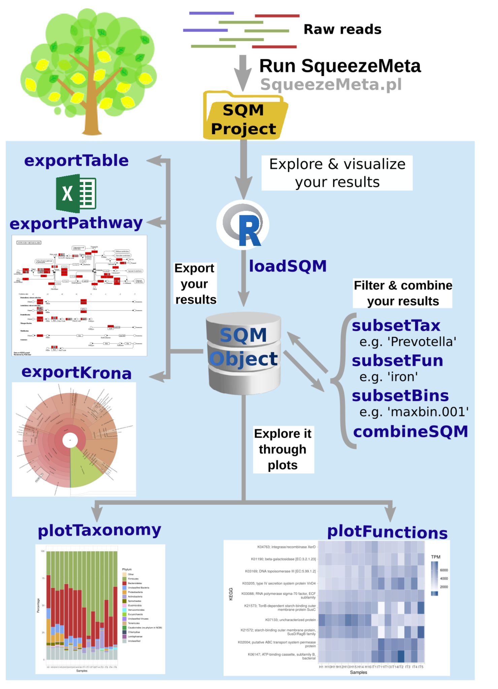

*********
Use cases
*********

.. _Assembly strategy:
Choosing an assembly strategy
=============================

SqueezeMeta can be run in four different modes, depending of the type of
multi-metagenome support. These modes are:

-  **Sequential mode:** All samples are treated individually and analysed
   sequentially.

-  **Coassembly mode:** Reads from all samples are pooled and a single
   assembly is performed. Then reads from individual samples are mapped
   to the coassembly to obtain gene abundances in each sample. Binning
   methods allow to obtain genome bins.

-  **Merged mode:** if many big samples are available, co-assembly could
   crash because of memory requirements. This mode achieves a comparable
   result with a procedure inspired by `the one used by Benjamin Tully for
   analysing TARA Oceans data <https://dx.doi.org/10.17504/protocols.io.hfqb3mw>`_.
   Briefly, samples are assembled individually and the resulting contigs are
   merged in a single co-assembly. Then the analysis proceeds as in the
   co-assembly mode. This is not the recommended procedure (use
   co-assembly if possible) since the possibility of creating chimeric
   contigs is higher. But it is a viable alternative in smaller computers in
   which standard co-assembly is not feasible.

-  **Seqmerge mode:** This is intended to work with more samples than the
   merged mode. Instead of merging all individual assemblies in a single
   step, which can be very computationally demanding, seqmerge works
   sequentially. First, it assembles individually all samples, as in
   merged mode. But then it will merge the two most similar assemblies.
   Similarity is measured as Amino Acid Identity values using the
   wonderful CompareM software by Donovan Parks. After this first
   merging, it again evaluates similarity and merge, and proceeds this
   way until all metagenomes have been merged in one. Therefore, for n
   metagenomes, it will need n-1 merging steps.

.. note::
  Note that the *merged* and *seqmerge* modes work well as a substitute of
  coassembly for running small datasets in computers with low memory
  (e.g. 16 Gb) but are very slow for analising large datasets (>10
  samples) even in workstations with plenty of resources. Still, setting
  ``-contiglen`` to 1000 or higher can make *seqmerge* a viable strategy
  even in those cases. Otherwise, we recommend to use either the
  sequential or the co-assembly modes.

Regarding the choice of assembler, MEGAHIT and SPAdes work better with
short Illumina reads, while Canu and Flye support long reads from PacBio
or ONT-Minion. MEGAHIT (the default in SqueezeMeta) is more
resource-efficient than SPAdes, consuming less memory, but SPAdes
supports more analysis modes and produces slightly better assembly
statistics. SqueezeMeta can call SPAdes in three different ways. The
option ``-a spades`` is meant for metagenomic datasets, and will
automatically add the flags ``–meta -k 21,33,55,77,99,127`` to the
*spades.py* call. Conversely, ``-a rnaspades`` will add the flags
``–rna -k 21,33,55,77,99,127``. Finally, the option ``-a spades_base``
will add no additional flags to the *spades.py* call. This can be used in
conjunction with ``–assembly options`` when one wants to fully customize
the call to SPAdes, e.g. for assembling single cell genomes.

.. _extassembly:
Analyzing user-supplied assemblies or bins
==========================================

An user-supplied assembly can be passed to SqueezeMeta with the flag
``-extassembly <your_assembly.fasta>``. The contigs in that fasta file
will be analyzed by the SqueezeMeta pipeline starting from step 2.
With this, you will be able to annotate your assembly, estimate its
abundance in your metagenomes/metatranscriptomes, and perform binning on it.

Additionally, a set of pre-existing genomes and bins can be passed to
SqueezeMeta with the flag ``-extbins <path_to_dir_with_bins>``. This will
work similarly to ``-extassembly``, but SqueezeMeta will treat each fasta
file in the input directory as an individual bin.

.. _metatranscriptomics:
Analyzing metatranscriptomes
============================
SqueezeMeta can be used for de-novo metatranscriptomic assembly, annotation
and quantification. Usage is similar as when analizing metagenomes, though
we recommend to also provide the ``--nobins`` to skip binning.  

Regarding the choice of assembler, we have obtained good results with rnaSPAdes
(``-a rnaspades``) although your mileage may vary.

If you have a pre-existing reference assembly or collection of genomes/bins you can
use the ``-extassembly`` or ``-extbins`` flags and skip de-novo assembly,
and instead just map the metatranscriptomic reads back to the reference to
quantify gene expression.

.. _metag metat:
Combined analysis of metagenomes and metatranscriptomes
=======================================================
SqueezeMeta allows the combined analysis of metagenomes and metatranscriptomes
in the same run. The recommended way of doing this is to perform de-novo assembly
and binning using only the metagenomes, and then mapping back the metatranscriptomic
reads to the assembly for estimating the expression of each contig/gene.

This can be achieved by adding the ``noassembly`` and ``nobinning`` tags to the
metatranscriptomic samples in your samples file. See :ref:`Samples file` for details.

An example would be

::

   Sample1_DNA Sample1_metagenom_R1.fastq.gz	pair1
   Sample1_DNA Sample1.metagenom_R2.fastq.gz	pair2
   Sample1_RNA Sample1_metatrans_R1.fastq.gz	pair1	noassebly	nobinning
   Sample1_RNA Sample1_metatrans_R2.fastq.gz	pair2	noassembly	nobinning
   Sample2_DNA Sample2_metagenom_R1.fastq.gz	pair1
   Sample2_DNA Sample2_metagenom_R2.fastq.gz	pair2
   Sample2_RNA Sample2_metatrans_R1.fastq.gz	pair1	noassembly	nobinning
   Sample2_RNA Sample2_metatrans_R2.fastq.gz	pair2	noassembly	nobinning

If you have a pre-existing reference assembly or collection of genomes/bins you can use the ``--extassembly`` or ``-extbins`` flags and skip de-novo assembly (but if going for binning, the ``--nobinning`` flag should still be added to the metatranscriptomes in the samples file).

.. _alt modes short:
Alternative analysis modes
==========================

In addition to the main SqueezeMeta pipeline, we provide extra scripts
that enable the analysis of individual reads and the annotation of sequences

1) :ref:`sqm_reads.pl <sqm_reads>`: This script performs taxonomic and functional
assignments on individual reads rather than contigs. This can be useful
when the assembly quality is low, or when looking for low abundance
functions that might not have enough coverage to be assembled.

2) :ref:`sqm_longreads.pl <sqm_longreads>`: This script performs taxonomic and functional
assignments on individual reads rather than contigs, assuming that more
than one ORF can be found in the same read (e.g. as happens in PacBio or
MinION reads).

3) :ref:`sqm_hmm_reads.pl <sqm_hmm_reads>`: This script provides a wrapper to the
`Short-Pair <https://sourceforge.net/projects/short-pair/>`__ software,
which allows to screen the reads for particular functions using an
ultra-sensitive HMM algorithm.

4) :ref:`sqm_mapper.pl <sqm_mapper>`: This script maps reads to a given reference using
one of the included sequence aligners (Bowtie2, BWA), and provides
estimation of the abundance of the contigs and ORFs in the reference.
Alternatively, it can be used to filter out the reads mapping to a given
reference.

5) :ref:`sqm_annot.pl <sqm_annot>`: This script performs functional and taxonomic
annotation for a set of genes, for instance these encoded in a genome
(or sets of contigs).

Working with Oxford Nanopore MinION and PacBio reads
====================================================

Since version 0.3.0, SqueezeMeta is able to seamlessly work with
single-end reads. In order to obtain better mappings of MinION and
PacBio reads against the assembly, we advise to use minimap2 for read
counting, by including the ``-map minimap2-ont`` (MinION) or ``-map minimap2-pb``
(PacBio) flags when calling SqueezeMeta. We also include
the Canu and Flye assemblers, which are specially tailored to work with
long, noisy reads. They can be selected by including the ``-a canu`` or
``-a flye`` flag when calling SqueezeMeta. As a shortcut, the ``-–minion``
flag will use both Canu and minimap2 for Oxford Nanopore MinION reads.
As an alternative to assembly, we also provide the ``sqm_longreads.pl``
script, which will predict and annotate ORFs within individual long
reads.

Working in a low-memory environment
===================================

In our experience, assembly and DIAMOND alignment against the nr
database are the most memory-hungry parts of the pipeline. By default
SqueezeMeta will set up the right parameters for DIAMOND and the Canu
assembler based on the available memory in the system. DIAMOND memory
usage can be manually controlled via the ``-b`` parameter (DIAMOND will
consume ~5\*\ *b* Gb of memory according to the documentation, but to be
safe we set ``-b`` to *free_ram/8*). Assembly memory usage is trickier, as
memory requirements increase with the number of reads in a sample. We
have managed to run SqueezeMeta with as much as 42M 2x100 Illumina HiSeq
pairs on a virtual machine with only 16Gb of memory. Conceivably, larger
samples could be split an assembled in chunks using the merged mode. We
include the shortcut flag ``-–lowmem``, which will set DIAMOND block size
to 3, and Canu memory usage to 15Gb. This is enough to make SqueezeMeta
run on 16Gb of memory, and allows the *in situ* analysis of Oxford
Nanopore MinION reads. Under such computational limitations, we have
been able to coassemble and analyze 10 MinION metagenomes (taken from
SRA project
`SRP163045 <https://www.ncbi.nlm.nih.gov/sra/?term=SRP163045>`__) in
less than 4 hours.

Tips for working in a computing cluster
=======================================

SqueezeMeta will work fine inside a computing cluster, but there are
some extra things that must be taken into account. Here is a list in
progress based on frequent issues that have been reported.

- Run ``test_install.pl`` to make sure that everything is properly configured

- If using the conda environment, make sure that it is properly activated by your batch script

- If an administrator has set up SqueezeMeta for you (and you have no write privileges in the installation directory), make sure they have run ``make_databases.pl``, ``download_databases.pl`` or ``configure_nodb.pl`` according to the installation instructions. Once again, ``test_install.pl`` should tell you whether things seem to be ok

- Make sure to request enough memory. See the previous section for a rough guide on what is “enough”. If you get a crash during the assembly or during the annotation step, it will be likely because you ran out of memory

- Make sure to manually set the ``-b`` parameter so that it matches the amount of memory that you requested divided by 8. Otherwise, SqueezeMeta will assume that it can use all the free memory in the node in which it is running. This is fine if you got a full node for yourself, but will lead to crashes otherwise

Downstream analysis of SqueezeMeta results
==========================================

SqueezeMeta comes with a variety of options to explore the results and
generate different plots. These are fully described in the documentation
and in the `wiki <https://github.com/jtamames/SqueezeMeta/wiki>`__.
Briefly, the three main ways to analyze the output of SqueezeMeta are
the following:

1) **Integration with R:** We provide the *SQMtools* R package, which
allows to easily load a whole SqueezeMeta project and expose the results
into R. The package includes functions to select particular taxa or
functions and generate plots. The package also makes the different
tables generated by SqueezeMeta easily available for third-party R
packages such as *vegan* (for multivariate analysis), *DESeq2* (for
differential abundance testing) or for custom analysis pipelines. See
examples
`here <https://github.com/jtamames/SqueezeMeta/wiki/Using-R-to-analyze-your-SQM-results>`__.
**SQMtools can also be used in Mac or Windows**, meaning that you can
run SqueezeMeta in your Linux server and then move the results to your
own computer and analyze them there. See advice for this below.

2) **Integration with the anvi’o analysis pipeline:** We provide a
compatibility layer for loading SqueezeMeta results into the anvi’o
analysis and visualization platform
(http://merenlab.org/software/anvio/). This includes a built-in query
language for selecting the contigs to be visualized in the anvi’o
interactive interface. See examples
`here <https://github.com/jtamames/SqueezeMeta/wiki/Loading-SQM-results-into-anvi'o>`__.

We also include utility scripts for generating
`itol <https://itol.embl.de/>`__ and
`pavian <https://ccb.jhu.edu/software/pavian/>`__ -compatible outputs.

Analyzing SqueezeMeta results in your desktop computer
======================================================

Many users run SqueezeMeta remotely (e.g. in a computing cluster).
However it is easier to explore the results interactively from your own
computer. Since version 1.6.2, we provide an easy way to achieve this.

1) In the system in which you ran SqueezeMeta, run the utility script
:ref:`sqm2zip` with
  ::

    sqm2zip.py /path/to/my_project /output/dir
  
  , where ``/path/to/my_project`` is the path to the output of SqueezeMeta, and
  ``/output/dir`` an arbitrary output directory.

2) This will generate a
file in ``/output/dir`` named ``my_project.zip``, which contains the
essential files needed to load your project into SQMtools. Transfer this
file to your desktop computer.

3) Assuming R is present in your desktop
computer, you can install SQMtools with:
  ::
    
    if (!require("BiocManager", quietly = TRUE)) { install.packages("BiocManager")}
    BiocManager::install("SQMtools")

This will work seamlessly in Windows and Mac computers, for Linux you
may need to previously install the *libcurl* development library.

4) You can load the project directly from the zip file (no need for
decompressing) with
  ::
  
    import(SQMtools)
    SQM = loadSQM("/path/to/my_project.zip")
